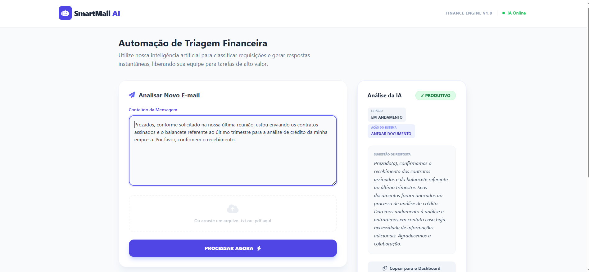

# SmartMail AI


Este projeto consiste em uma API inteligente para triagem e automação de emails corporativos. 
A solução combina Machine Learning (ML) estatístico local com Modelos de Linguagem de Grande Escala (LLM - Gemini) para classificação, decisão de fluxo e geração de respostas automáticas.

A arquitetura foi projetada para oferecer alta performance, baixo custo operacional e robustez através de um pipeline híbrido:

1. ML estatístico (TF-IDF + Naive Bayes): Responsável pela classificação rápida e local.
2. LLM Gemini: Atua como camada de validação semântica ou fallback para casos de baixa confiança.
3. Decision Engine: Motor determinístico que define as ações do sistema com base nas classificações.

## Demo


## Objetivo do Sistema

Classificar emails automaticamente e extrair os seguintes metadados:

- Intenção: Categoria principal do contato.
- Classificação: Definição entre conteúdo Produtivo ou Improdutivo.
- Estágio: Fase atual do atendimento (início, em andamento ou encerramento).
- Ação: Próximo passo operacional (abrir chamado, arquivar, etc).
- Resposta Automática: Sugestão de texto para retorno ao cliente.

## Pipeline de Inteligência

O fluxo de processamento segue a lógica abaixo:
![Fluxograma do projeto: Email Input<br>
  ↓<br>
Feature Extractor (Regex & Metadata)<br>
  ↓<br>
Intent Predictor (Naive Bayes Local)<br>
  ↓<br>
┌──────────────────────────────────────────┐<br>
│ Confiança >= 0.75?                       │<br>
├────────────────────┬─────────────────────┤<br>
│        SIM         │         NÃO         │<br>
│ analyze_email      │ analyze_email       │<br>
│ (With Intent Hint) │ (Zero-shot Analysis)│<br>
└────────────────────┴─────────────────────┘<br>
  ↓<br>
Decision Engine (Mapping Matrix)<br>
  ↓<br>
Final Response JSON<br>](media/fluxograma.png)

## Classificações Suportadas
- nova solicitacao
- resposta a solicitacao existente
- envio de documento
- confirmacao ou agradecimento
- duvida ou pergunta
- mensagem social
- marketing ou spam

## Stack Tecnológica
Backend:
- Python 3.10+
- FastAPI
- Pydantic
- Uvicorn

Machine Learning & NLP:
- scikit-learn: TF-IDF (1–3 grams) e Multinomial Naive Bayes.
- NLTK: Processamento de stopwords em Português (PT-BR).
- Google Gemini API: Modelos com fallback automático (gemini-2.5-flash, gemini-2.5-flash-lite, gemini-3-flash-preview).
- joblib: Persistência de modelos treinados.

Utilitários:
- pdfplumber: Extração de texto de anexos PDF.
- python-dotenv: Gestão de variáveis de ambiente.
- logging: Rastreabilidade estruturada do pipeline.

## Estrutura do Projeto

app/<br>
├── core/<br>
│   ├── pipeline.py            # Orquestração do fluxo<br>
│   └── decision_engine.py      # Lógica de negócio e ações<br>
├── ml <br>
│   ├── intent_predictor.py     # Inferência local do modelo<br>
│   └── train_intent_classifier.py # Script de treinamento<br>
├── nlp/<br>
│   ├── semantic_analyzer.py    # Integração com LLM<br>
│   └── feature_extractor.py    # Extração de padrões via Regex<br>
├── providers/<br>
│   └── gemini_provider.py      # Cliente de API Generativa<br>
├── data/<br>
│   └── emails_dataset_250.csv  # Base de conhecimento para treino<br>
├── models/<br>
│   └── intent_classifier.joblib # Modelo binário exportado<br>
├── routes.py                   # Definição dos endpoints<br>
├── main.py                     # Ponto de entrada da aplicação<br>
└── config.py                   # Configurações globais<br>

## Configuração e Instalação

1. Variáveis de Ambiente

Crie um arquivo ```.env``` na raiz do projeto:
```bash
GEMINI_API_KEY=SUA_CHAVE_AQUI
```

2. Instalação de Dependências

- Criar ambiente virtual
```bash
python -m venv venv
```

- Ativar ambiente (Windows)
```bash
venv\Scripts\activate
```
- Ativar ambiente (Linux/Mac)
```bash
source venv/bin/activate
```

- Instalar pacotes
```bash
pip install -r requirements.txt
```
3. Treinamento do Modelo

Antes de iniciar a API, é necessário gerar o binário do classificador local:

```bash
python -m app.ml.train_intent_classifier
```

## Endpoints da API

**Processar Email** 
```bash
POST /processar-email
```
| Parâmetro | Tipo | Descrição | 
| :---------- | :--------- | :---------------------------------- |
| `texto` | `string` | Conteúdo textual do email **(opcional se houver arquivo).** |
| `arquivo` | `file` | Anexo em formato PDF ou TXT **(opcional se houver texto).** |

## Exemplo de Resposta (JSON)

```bash
JSON{
  "intent": "nova solicitacao",
  "classificacao": "Produtivo",
  "estagio": "inicio",
  "acao": "abrir_chamado",
  "resposta_automatica": "Recebemos sua solicitação e ela já está em análise por nossa equipe técnica."
}
```

## Estratégias de Robustez

- Fallback de Modelos: Caso o modelo principal do Gemini apresente instabilidade ou limite de cota, o sistema alterna automaticamente para versões alternativas.
- Threshold de Confiança: O sistema apenas confia na classificação local se a probabilidade estatística for superior a 75%, caso contrário, delega a decisão ao LLM.
- Observabilidade: Logs detalhados registram o tempo de resposta, o modelo utilizado e a confiança da predição para auditoria.

## Filosofia de Desenvolvimento

O projeto segue a premissa de "ML quando possível, LLM quando necessário". Isso garante que o sistema seja financeiramente sustentável e extremamente rápido para demandas comuns, reservando o poder computacional da IA Generativa para a interpretação de contextos complexos.

## License

[MIT](https://choosealicense.com/licenses/mit/)


